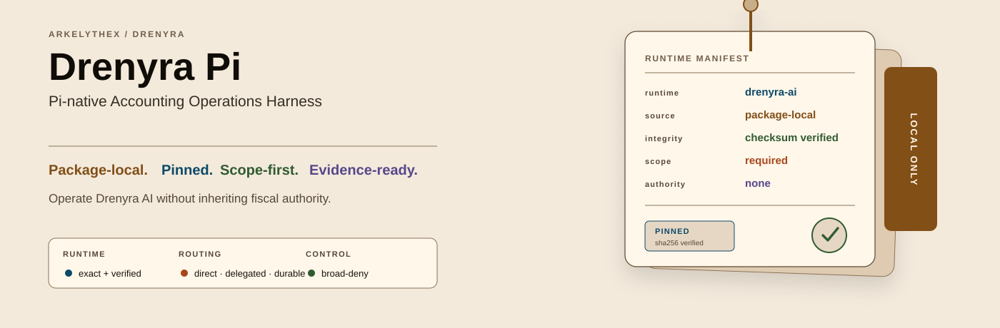
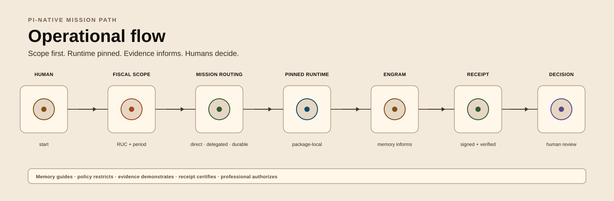
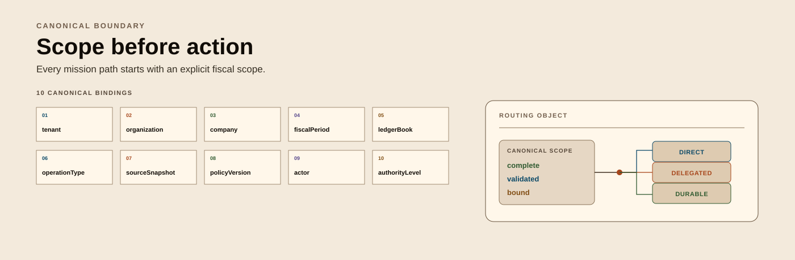
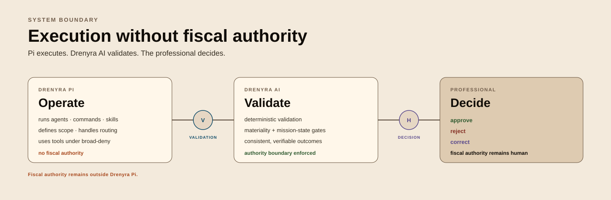

# Drenyra Pi

> **Public source repository (open-core intention)** — this repository is **publicly visible** on GitHub as part of the Drenyra open-core transition intention (charter §9: intention, not contractual promise); packaged artifacts and commercial distribution remain contractual and never public. See the Drenyra [Private Product Policy](https://github.com/arkelythex/drenyra-command-center/blob/main/docs/products/private-product-policy.md).
>
> **Pi-native Accounting Operations Harness** — the best way to operate Drenyra AI from Pi.
>
> **Status: pre-alpha (v0.0.1-prealpha.1).** The harness extraction from
> `arkelythex/drenyra-command-center` (`packages/pi`) is **complete**: this
> repository is now the single source of truth for the Pi accounting harness
> (fiscal skills, FSD prompts, RED contracts, fiscal-guard extension, theme).
> Nothing here is production-ready yet; version policy is `0.0.1-prealpha.x`
> until the first frozen contract, then `0.1.0`.

Drenyra Pi is the direct counterpart of `gentle-pi` for the accounting domain: a Pi extension that packages the operator experience for Drenyra AI. It does **not** contain the full accounting engine — it installs and consumes a pinned, verified, package-local version of Drenyra AI, exactly like Gentle Pi does with Gentle AI.

<div align="center">



</div>

## Operational flow

<div align="center">



</div>

The visual flow is fully represented in text: **human start → fiscal scope (RUC and period) → mission routing → pinned, sealed runtime → Engram memory and append-only evidence → signed, verified cryptographic receipt → human approve or reject decision**.

## What it provides

- **Accounting operator persona** — warm, direct, fiscal-first operator behavior.
- **Startup panel** — company and fiscal period context on session start.
- **`/drenyra:*` commands** — doctor, scope, status, capabilities, company/period context, missions, receipts, evidence, verify, and close (see [Command reference](#command-reference)).
- **Pi-native subagents** — accounting agents for exploration, apply, verify, review.
- **Model routing** — per-phase model selection for fiscal work.
- **Packaged skills** — Drenyra-specific skills shipped with the extension.
- **RDA chains** — Receipt-Driven Accounting command chains.
- **Tool safety** — broad-deny, narrow-allow tool permissions for fiscal actions.
- **Company & period context** — RUC-scoped context threading across tools and agents.
- **Drenyra Engram integration** — institutional memory access (memory never authorizes).
- **Pinned Drenyra AI runtime** — exact verified version, package-local, never `PATH`.

### Drenyra Dominion Program

Drenyra Pi is a participant in the [Drenyra Dominion Program](https://github.com/arkelythex/drenyra-ai/tree/main/openspec/programs/drenyra-dominion), the federated program master in `drenyra-ai` that fixes vision, authority, contracts, dependencies, gates, and sequencing across every Drenyra repository. The program follows a master + vertical SDD model: one master SDD fixes the constitution, and vertical SDDs deliver complete capabilities that may traverse repositories while each repository preserves its ownership and boundaries. Drenyra Pi holds only its local change plus a reference to this master — full specs are never copied here.

| SDD | Role in Drenyra Pi |
| --- | --- |
| [SDD-020 — Universal Agent Configurator](https://github.com/arkelythex/drenyra-ai/tree/main/openspec/programs/drenyra-dominion/sdds/sdd-020-configurator) | Served primarily by Drenyra Pi: `install`, `doctor`, `sync`, `upgrade`, `rollback` plus host integration |
| [SDD-030 — Organic Accounting Work Routing](https://github.com/arkelythex/drenyra-ai/tree/main/openspec/programs/drenyra-dominion/sdds/sdd-030-routing) | Direct / delegated / durable-mission routing from evidence and risk |
| [SDD-040 — Receipt-Driven Accounting v2](https://github.com/arkelythex/drenyra-ai/tree/main/openspec/programs/drenyra-dominion/sdds/sdd-040-rda-v2) | Frozen candidate, proportional review, bounded correction, reusable receipt (RDA v2 chains) |

The master owns the full program catalog — SDD-010 (ecosystem contracts / release train), SDD-050 (monthly close), SDD-070 (skills), SDD-080 (Engram memory), SDD-090 (Guardian), SDD-110 (production), plus SDD-000/060/100 — which Drenyra Pi references only and never duplicates. Pi's served [SDD-020 — Universal Agent Configurator](https://github.com/arkelythex/drenyra-ai/tree/main/openspec/programs/drenyra-dominion/sdds/sdd-020-configurator) is **planned** (Wave 1) in the master and gated by the master's [Gate 0](https://github.com/arkelythex/drenyra-ai/tree/main/openspec/programs/drenyra-dominion/gate-0.md) — **in progress**. **No Pi-local implementation of SDD-020 proceeds until the master promotes readiness.** The historical harness draft that reused the SDD-050 label (the early "Drenyra Pi" harness spec) is reconciled in [harness-draft-conformance.md](docs/architecture/harness-draft-conformance.md): the master assigns SDD-050 to monthly close, and the harness was delivered via `pi-sdd-010-participation` + extraction.

Drenyra Pi executes agents and tools with pinned versions and **never authorizes fiscal operations** — fiscal authority remains in `drenyra-ai`.

## Install

```bash
pi install npm:drenyra-pi
```

## First run

Inside Pi, follow this order — each step's prerequisite is the previous one:

1. **`/drenyra:doctor`** — verifies the pinned, package-local Drenyra AI runtime (checksum + version, fails closed on any mismatch). The startup panel runs the same check at activation.
2. **`/drenyra:scope`** — shows the 10-element canonical scope and what is missing. Bind it with `/drenyra:scope set <tenant> <organization> <company> <fiscalPeriod> <ledgerBook> <operationType> <sourceSnapshot> <policyVersion> <actor> <authorityLevel>` (or set company and period first via `/drenyra:company` and `/drenyra:period`).
3. **`/drenyra:mission <intent>`** — starts a mission once the scope is complete (`monthly-close | correction | reconciliation | invoice-review | compliance-check`).
4. **`/drenyra:status`** — confirms the active company/period, mission state, and next authorized action.

## Command reference

Bootstrap, context, and read commands run **before** the scope is complete (pre-scope policy):

| Command | Purpose |
| --- | --- |
| `/drenyra:doctor` | Verify the pinned runtime; fails closed |
| `/drenyra:status` | Read-only status: company, period, mission state, next authorized action |
| `/drenyra:capabilities` | Engine + harness capabilities, authority modes, registered commands |
| `/drenyra:scope` | Read or bind the 10-element canonical scope |
| `/drenyra:company` | Set the company RUC (11 digits, check-digit-validated) |
| `/drenyra:period` | Set the fiscal period (`YYYYMM`) |
| `/drenyra:context` | Show the bound company + fiscal period |
| `/drenyra:models` | Model routing registry (advisory) |
| `/drenyra:preflight` | Scope + pinned runtime preflight (read-only) |
| `/drenyra:persona` | Toggle the fiscal operator persona on/off |
| `/drenyra:install` | Render the managed composition + pin asset under `~/.drenyra` (configurator) |
| `/drenyra:sync` | Synchronize the managed composition with the packaged version (idempotent) |

Mission, receipt, evidence, and chain commands require a **complete canonical scope** (they fail closed otherwise):

| Command | Purpose |
| --- | --- |
| `/drenyra:mission <intent>` | Start an EDA mission |
| `/drenyra:continue` | Advance the active mission |
| `/drenyra:resume <mission-id>` | Resume a mission from the durable store |
| `/drenyra:receipt <id>` | Show a receipt; `verify <id>` checks it |
| `/drenyra:evidence <op-json>` | Evidence-graph operations (add node/edge, query lineage) |
| `/drenyra:verify` | Read-only integrity verify chain |
| `/drenyra:reconcile` | Bank-vs-ledger reconciliation chain |
| `/drenyra:close <approverId>` | Monthly-close chain with explicit approval |

## Model routing



`/drenyra:models` exposes the documented routing registry
(`drenyra.model-routing.v1`): each EDA phase is mapped to the accounting role that
should carry it. The installed Pi ExtensionAPI slice exposes no model-routing API
(G30), so this registry is **advisory — it documents intent, it never grants
authority** (design §15 "No model authority").

| Phase | Role | Guidance |
| --- | --- | --- |
| `intake` / `bind-scope` | clerk | Scope-first intake; no interpretation |
| `ingest` / `normalize` | ledger-analyst | Bounded source refs; deterministic normalization, BigInt cents |
| `classify` | ledger-analyst | Classify with cited evidence |
| `reconcile` | reconciliation-agent | Reconcile with anomaly detection |
| `investigate` | accounting-scout | Investigate anomalies with evidence |
| `propose` | close-controller | Evidence-cited proposal only |
| `verify` | evidence-builder | Verify integrity, never mutate |
| `approve` | tax-controller-pe | Human approval; never self-approve |
| `execute` / `close` / `archive` | close-controller | Exact approved target; seal with completion receipt |

### Advisory model tiers by mission state

Model choice is the operator's; the harness only documents the shape. The rule of
thumb: **cost scales with judgment required, and the deterministic core never
touches an LLM**. Suggested tiers:

| Mission state | Shape | Why |
| --- | --- | --- |
| `WAITING_FOR_EVIDENCE` (staging, OCR, matching) | Fast/cheap — flash-tier | Bulk mechanical work |
| Candidate drafting (journal/correction) | Mid reasoning | Draft, never decide |
| `BLOCKED_BY_GATE` / materiality scoring | **No LLM — deterministic core** | Materiality policy is frozen BigInt logic, not a model |
| `AWAITING_APPROVAL` (summary for the human) | High reasoning, clarity-first | The professional decides on this summary |
| `verify` / Guardian Angel | Independent model, fresh context, different provider if possible | Adversarial review must not share the proposer's blind spots |

## Institutional memory (Drenyra Engram)

Drenyra Pi accesses [Drenyra Engram](https://github.com/arkelythex/drenyra-engram)
as institutional accounting memory. The boundary is non-negotiable:

- **Memory informs, never authorizes.** No observation is ever permission to act.
- **Memory never feeds a gate.** `mission-state`, `receipt`, and `approval` gates
  are frozen contracts in drenyra-ai; if Engram could influence them, the
  ecosystem's own "inform, never authorize" rule would be broken.
- **Memory decides WHAT to propose, never HOW MUCH review.** Which candidate to
  draft ("this provider always has 12% detracción", "this account was
  reclassified last month by human error") is a proposal question; how much
  review a candidate needs is decided only by the deterministic materiality
  policy (BigInt thresholds, frozen in drenyra-ai).

## Host strategy



Drenyra Pi is the v1.0 host: the ecosystem's base runtime, and the name says so.
The headless-core delivery (library, CLI, or MCP — per the drenyra-ai v1.0
strategy) means less host surface equals less regulatory risk while validating
with real Peruvian accountants. Claude Code is the planned second host; the full
15-agent matrix of Gentle-AI is not a v1.0 goal for the accounting domain.

## Layout

```text
agents/      Pi-native accounting subagents (mirrors in assets/agents/)
assets/      Static assets (branding, chain maps, policies, schemas)
chains/      RDA command chain implementations
contracts/   Package and runtime contracts (see contracts/)
docs/        Architecture and boundary documentation
extensions/  Flat Pi extension entrypoints and registration
lib/         Top-level domain logic (scope, missions, receipts, evidence)
openspec/    SDD artifacts (changes/, specs/)
prompts/     Prompt templates and command chains
runtime/     Runtime bootstrap, drenyra-ai pinning and verification
scripts/     Build, install, and package-verification scripts
skills/      Packaged Drenyra skills
themes/      Pi themes
vendored/    Pinned drenyra-ai release artifact (never PATH)
__tests__/   Test suites for commands, chains, and permissions
```

## Dependency

```text
drenyra-pi
  └── installs and consumes drenyra-ai (pinned, verified, package-local)
```

Drenyra Pi uses an **exact, verified, package-local version of Drenyra AI** — never whatever binary happens to be on `PATH`. See [contracts/runtime-dependency.md](contracts/runtime-dependency.md).

## Ecosystem

| Project | Role |
| --- | --- |
| [Drenyra Command Center](https://github.com/arkelythex/drenyra-command-center) | Command Center — web application (consumes AI) |
| [Drenyra AI](https://github.com/arkelythex/drenyra-ai) | Agent ecosystem (installed, pinned) |
| [Drenyra Engram](https://github.com/arkelythex/drenyra-engram) | Institutional accounting memory (used) |

**Direction rule:** Drenyra Pi depends on Drenyra AI and Drenyra Engram. It never leaks into Drenyra AI's contracts, and Drenyra AI never knows Drenyra Pi exists.

## National alignment

Drenyra Pi is positioned for the Peruvian digital-government and data-protection context. This is **positioning and roadmap direction**, not an implemented compliance claim.

| National reference | Position |
| --- | --- |
| [ENGD 2026–2030](https://www.gob.pe/99097-estrategia-nacional-de-gobierno-de-datos-2026-2030) | Approved by [RM N.° 049-2026-PCM](https://www.gob.pe/institucion/pcm/normas-legales/7739698-049-2026-pcm), derived from the Política Nacional de Transformación Digital 2030. Its 2030 vision — a trusted, innovative, secure digital ecosystem — and six action lines (data regulatory framework; data quality, management and privacy; open data and interoperability; infrastructure/platforms, talent/culture, ecosystem/collaboration) frame the governed-data direction. |
| [PIDE interoperability](https://guias.servicios.gob.pe/creacion-servicios-digitales/reutilizables/interoperabilidad) | PIDE enables electronic data exchange among State entities and is used by more than 450 public entities. Drenyra Pi does **not** claim automatic PIDE access: integration would require applicable authorization, purpose, and agreements. |
| [Reglamento de la Ley N.º 29733](https://www.gob.pe/institucion/anpd/normas-legales/6554453-16-2024-jus) | The new reglamento is DS N.º 016-2024-JUS — tracked as personal-data-protection context for security/privacy-by-design work. |
| [ENIA 2026–2030](https://busquedas.elperuano.pe/dispositivo/NL/2511535-1) | Approved under RM N.° 152-2026-PCM. Its public-sector AI governance mechanisms (OIA, Catálogo IA Perú) are context only — not a private-sector legal classification of Drenyra's tax AI. |

**Differentiators:** governed data, explicit provenance, evidence receipts, human authorization, interoperable adapters, security/privacy by design, and supervised AI. Internal Ed25519 integrity receipts verify harness state; they are **not** Peruvian legally-valid digital signatures.

## License

Proprietary. © 2026 Arkelythex. All rights reserved. See [LICENSE](LICENSE).
