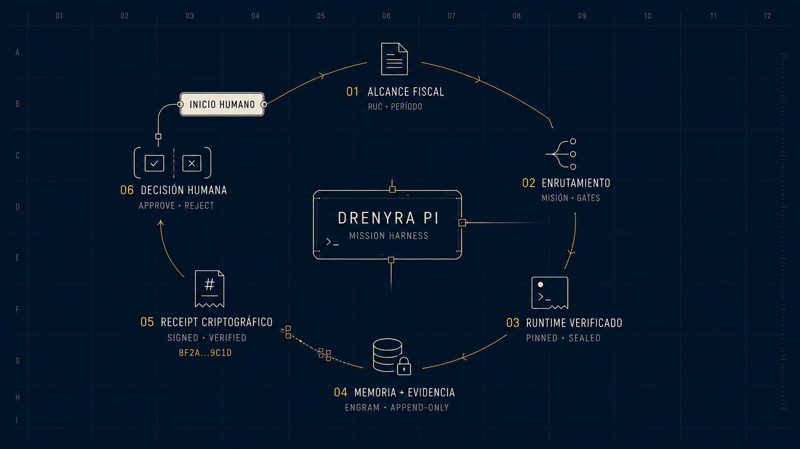

<div align="center">


<p><code>operator → Pi harness → pinned Drenyra AI runtime → Engram/evidence → receipt → operator</code></p>

</div>

# Drenyra Pi

> **Private commercial product** — this repository is **private**; distribution is contractual, never public. See the Drenyra [Private Product Policy](https://github.com/arkelythex/drenyra-command-center/blob/main/docs/products/private-product-policy.md).
>
> **Pi-native Accounting Operations Harness** — the best way to operate Drenyra AI from Pi.
>
> **Status: pre-alpha.** The harness is being extracted from `arkelythex/drenyra-command-center` (`packages/pi`) through vertical slices. Nothing here is production-ready yet.

Drenyra Pi is the direct counterpart of `gentle-pi` for the accounting domain: a Pi extension that packages the operator experience for Drenyra AI. It does **not** contain the full accounting engine — it installs and consumes a pinned, verified, package-local version of Drenyra AI, exactly like Gentle Pi does with Gentle AI.

## Operational flow

<div align="center">



</div>

The visual flow is fully represented in text: **human start → fiscal scope (RUC and period) → mission routing → pinned, sealed runtime → Engram memory and append-only evidence → signed, verified cryptographic receipt → human approve or reject decision**.

## What it provides

- **Accounting operator persona** — warm, direct, fiscal-first operator behavior.
- **Startup panel** — company and fiscal period context on session start.
- **`/drenyra:*` commands** — doctor, scope, status, capabilities, company/period context, missions, receipts, evidence, verify, and close (see [Command reference](#command-reference)).
- **Pi-native subagents** — accounting agents for exploration, apply, verify, review.
- **Model routing** — per-phase model selection for fiscal work.
- **Packaged skills** — Drenyra-specific skills shipped with the extension.
- **RDA chains** — Receipt-Driven Accounting command chains.
- **Tool safety** — broad-deny, narrow-allow tool permissions for fiscal actions.
- **Company & period context** — RUC-scoped context threading across tools and agents.
- **Drenyra Engram integration** — institutional memory access (memory never authorizes).
- **Pinned Drenyra AI runtime** — exact verified version, package-local, never `PATH`.

### Drenyra Dominion Program

Drenyra Pi is a participant in the [Drenyra Dominion Program](https://github.com/arkelythex/drenyra-ai/tree/main/openspec/programs/drenyra-dominion), the federated program master in `drenyra-ai` that fixes vision, authority, contracts, dependencies, gates, and sequencing across every Drenyra repository. The program follows a master + vertical SDD model: one master SDD fixes the constitution, and vertical SDDs deliver complete capabilities that may traverse repositories while each repository preserves its ownership and boundaries. Drenyra Pi holds only its local change plus a reference to this master — full specs are never copied here.

| SDD | Role in Drenyra Pi |
| --- | --- |
| [SDD-020 — Universal Agent Configurator](https://github.com/arkelythex/drenyra-ai/tree/main/openspec/programs/drenyra-dominion/sdds/sdd-020-configurator) | Served primarily by Drenyra Pi: `install`, `doctor`, `sync`, `upgrade`, `rollback` plus host integration |
| [SDD-030 — Organic Accounting Work Routing](https://github.com/arkelythex/drenyra-ai/tree/main/openspec/programs/drenyra-dominion/sdds/sdd-030-routing) | Direct / delegated / durable-mission routing from evidence and risk |
| [SDD-040 — Receipt-Driven Accounting v2](https://github.com/arkelythex/drenyra-ai/tree/main/openspec/programs/drenyra-dominion/sdds/sdd-040-rda-v2) | Frozen candidate, proportional review, bounded correction, reusable receipt (RDA v2 chains) |

Drenyra Pi executes agents and tools with pinned versions and **never authorizes fiscal operations** — fiscal authority remains in `drenyra-ai`.

## Install

```bash
pi install npm:drenyra-pi
```

## First run

Inside Pi, follow this order — each step's prerequisite is the previous one:

1. **`/drenyra:doctor`** — verifies the pinned, package-local Drenyra AI runtime (checksum + version, fails closed on any mismatch). The startup panel runs the same check at activation.
2. **`/drenyra:scope`** — shows the 10-element canonical scope and what is missing. Bind it with `/drenyra:scope set <tenant> <organization> <company> <fiscalPeriod> <ledgerBook> <operationType> <sourceSnapshot> <policyVersion> <actor> <authorityLevel>` (or set company and period first via `/drenyra:company` and `/drenyra:period`).
3. **`/drenyra:mission <intent>`** — starts a mission once the scope is complete (`monthly-close | correction | reconciliation | invoice-review | compliance-check`).
4. **`/drenyra:status`** — confirms the active company/period, mission state, and next authorized action.

## Command reference

Bootstrap, context, and read commands run **before** the scope is complete (pre-scope policy):

| Command | Purpose |
| --- | --- |
| `/drenyra:doctor` | Verify the pinned runtime; fails closed |
| `/drenyra:status` | Read-only status: company, period, mission state, next authorized action |
| `/drenyra:capabilities` | Engine + harness capabilities, authority modes, registered commands |
| `/drenyra:scope` | Read or bind the 10-element canonical scope |
| `/drenyra:company` | Set the company RUC (11 digits, check-digit-validated) |
| `/drenyra:period` | Set the fiscal period (`YYYYMM`) |
| `/drenyra:context` | Show the bound company + fiscal period |
| `/drenyra:models` | Model routing registry |

Mission, receipt, evidence, and chain commands require a **complete canonical scope** (they fail closed otherwise):

| Command | Purpose |
| --- | --- |
| `/drenyra:mission <intent>` | Start an EDA mission |
| `/drenyra:continue` | Advance the active mission |
| `/drenyra:resume <mission-id>` | Resume a mission from the durable store |
| `/drenyra:receipt <id>` | Show a receipt; `verify <id>` checks it |
| `/drenyra:evidence <op-json>` | Evidence-graph operations (add node/edge, query lineage) |
| `/drenyra:verify` | Read-only integrity verify chain |
| `/drenyra:reconcile` | Bank-vs-ledger reconciliation chain |
| `/drenyra:close <approverId>` | Monthly-close chain with explicit approval |

## Layout

```text
agents/      Pi-native accounting subagents (mirrors in assets/agents/)
assets/      Static assets (branding, chain maps, policies, schemas)
chains/      RDA command chain implementations
contracts/   Package and runtime contracts (see contracts/)
docs/        Architecture and boundary documentation
extensions/  Flat Pi extension entrypoints and registration
lib/         Top-level domain logic (scope, missions, receipts, evidence)
openspec/    SDD artifacts (changes/, specs/)
prompts/     Prompt templates and command chains
runtime/     Runtime bootstrap, drenyra-ai pinning and verification
scripts/     Build, install, and package-verification scripts
skills/      Packaged Drenyra skills
themes/      Pi themes
vendored/    Pinned drenyra-ai release artifact (never PATH)
__tests__/   Test suites for commands, chains, and permissions
```

## Dependency

```text
drenyra-pi
  └── installs and consumes drenyra-ai (pinned, verified, package-local)
```

Drenyra Pi uses an **exact, verified, package-local version of Drenyra AI** — never whatever binary happens to be on `PATH`. See [contracts/runtime-dependency.md](contracts/runtime-dependency.md).

## Ecosystem

| Project | Role |
| --- | --- |
| [Drenyra Command Center](https://github.com/arkelythex/drenyra-command-center) | Command Center — web application (consumes AI) |
| [Drenyra AI](https://github.com/arkelythex/drenyra-ai) | Agent ecosystem (installed, pinned) |
| [Drenyra Engram](https://github.com/arkelythex/drenyra-engram) | Institutional accounting memory (used) |

**Direction rule:** Drenyra Pi depends on Drenyra AI and Drenyra Engram. It never leaks into Drenyra AI's contracts, and Drenyra AI never knows Drenyra Pi exists.

## License

Proprietary. © 2026 Arkelythex. All rights reserved. See [LICENSE](LICENSE).
