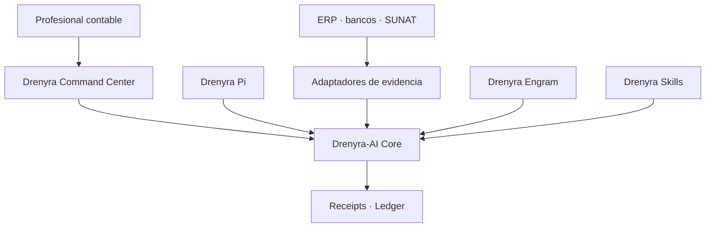
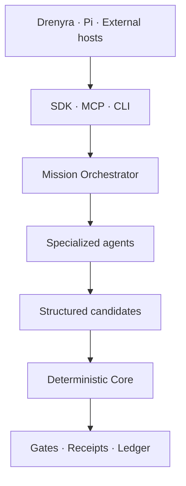

# Ecosystem Boundaries — Drenyra Pi (Pi-native Accounting Operations Harness)

> **Last updated:** 2026-08-18 (harness-draft conformance + stale-count reconciliation).
>
> Fiscal convention: monetary values in the Drenyra ecosystem are BigInt cents; no float is ever used for money; version/sequence numbers are JSON integers, never floats.

## Role in the ecosystem

Drenyra Pi is the **Pi-native Accounting Operations Harness**: a Pi extension that packages the operator experience for Drenyra AI. It is the direct accounting-domain counterpart of `gentle-pi`.

Drenyra Pi does **not** contain the accounting engine. It **installs and consumes a pinned, verified, package-local version of Drenyra AI** — never whatever binary happens to be on `PATH`.

## What Drenyra Pi is (in scope)

- Accounting operator persona: warm, direct, fiscal-first behavior.
- Startup panel: company and fiscal period context on session start.
- `/drenyra:*` commands: doctor, scope, status, capabilities, company, period, mission, receipt, evidence, verify, reconcile, close.
- Pi-native subagents: exploration, apply, verify, review.
- Model routing: per-phase model selection for fiscal work.
- Packaged skills and RDA (Receipt-Driven Accounting) command chains.
- Tool safety: broad-deny, narrow-allow permissions for fiscal actions.
- Company & period context: RUC-scoped context threaded across tools and agents.
- Drenyra Engram integration: institutional memory access (memory never authorizes).

## Explicit non-goals

Drenyra Pi is **not**:

- The accounting engine — that is `arkelythex/drenyra-command-center` (product) and `arkelythex/drenyra-ai` (runtime).
- An agent runtime — missions, candidates, receipts, gates, and ledger belong to `drenyra-ai`.
- A memory engine — observations and scope-first search belong to `drenyra-engram`.

## What Drenyra Pi must NOT contain long-term

- **Fiscal logic in command handlers.** Commands are thin: validate scope, delegate to Drenyra AI domain operations, render results.
- **A second copy of the runtime.** The engine is installed and pinned, never vendored or re-implemented.
- **Product surfaces** (UI, tenants, documents, SUNAT flows) — those live in Drenyra.

## National alignment (boundary statement)

National alignment is positioning and roadmap direction, and it stays inside the ecosystem boundaries:

- Drenyra Pi does **not** currently implement a full data catalog, a retention engine, an official digital signature, PIDE access, or a public-sector institutional edition.
- The evidence-adapter line ("Adaptadores: gather evidence from ERP, banks, SUNAT and files") is the interoperable-adapter differentiator. Any State-entity exchange — for example [PIDE](https://guias.servicios.gob.pe/creacion-servicios-digitales/reutilizables/interoperabilidad), used by more than 450 public entities — requires applicable authorization, purpose, and agreements, never automatic access.
- [ENGD 2026–2030](https://www.gob.pe/99097-estrategia-nacional-de-gobierno-de-datos-2026-2030) (approved by [RM N.° 049-2026-PCM](https://www.gob.pe/institucion/pcm/normas-legales/7739698-049-2026-pcm), derived from the Política Nacional de Transformación Digital 2030) frames the governed-data direction; [ENIA 2026–2030](https://busquedas.elperuano.pe/dispositivo/NL/2511535-1) (RM N.° 152-2026-PCM) public-sector governance (OIA, Catálogo IA Perú) is context, not a private-sector legal classification.
- Internal Ed25519 integrity receipts are distinct from Peruvian legally-valid digital signatures; no receipt confers legal signature status.

## Ecosystem authority contract (Design 1 — approved boundary)

### Responsibility contract

| Component | Responsibility | Must never |
| --- | --- | --- |
| **Drenyra** | Interface, inboxes, visualization, review and approval | Re-implement gates or mutate authoritative states directly |
| **Drenyra-AI** | Missions, candidates, materiality, authority, gates, receipts, ledger and recovery | Depend on the UI or trust agent narratives |
| **Drenyra Pi** | Harness optimized to run specialized agents | Resolve versions from PATH or bypass the Core |
| **Drenyra Engram** | Institutional memory and context retrieval | Authorize actions or treat memories as evidence |
| **Drenyra Skills** | Versioned accounting, fiscal and jurisdictional knowledge | Silently change frozen policies |
| **Adaptadores** | Gather evidence from ERP, banks, SUNAT and files | Claim success without a verifiable response |
| **Guardian Angel** | Independent and adversarial review | Approve its own work or substitute the professional |

### Chain of authority

1. The professional requests an outcome from Drenyra.
2. Drenyra creates a mission through the published Drenyra-AI contract.
3. Agents research, propose and prepare candidates.
4. Drenyra-AI computes identity, scope and materiality.
5. Gates determine which evidence and approval are required.
6. The professional approves when appropriate.
7. An adapter executes or confirms the external action.
8. Drenyra-AI records the result with a signed receipt and verifiable ledger.
9. Drenyra only represents the authoritative state returned by the Core.

### Dependency rule

- Drenyra and Drenyra Pi consume **published versions** of Drenyra-AI. Drenyra-AI never depends on them.
- The UI may go down and rebuild from Core state; a transcript may be lost and the mission recovered from events and evidence.
- **No consumer may convert a Core rejection into an approval.**

## Agent orchestration contract (Design 3 — approved in `drenyra-ai`)

Design 3 (agents, skills, and integrations) is **approved in `drenyra-ai`**
(`docs/design/design-03-agents-skills-integrations.md`) and applies to the whole
ecosystem. Its architectural rule: **use AI to interpret, investigate, and
propose; use deterministic code to compute, validate, authorize, and record.**
Not every function becomes an "agent" — monetary calculations, states,
materiality, isolation, gates, hashes, and receipts stay outside the model.

### MissionOrchestrator holds no fiscal authority

The MissionOrchestrator controls the mission but **never authorizes**:
it splits the close into bounded jobs, selects compatible agents and skills,
provides minimal context and immutable evidence, controls budget, attempts,
and concurrency, receives structured results, delivers candidates to the
Core, and pauses when evidence or a human decision is missing.
**The Core remains the only component able to accept a transition.**

### Agents propose; they never decide

Each specialized agent receives a bounded task and returns a **known schema**
(evidence manifest, exceptions and candidates, explained differences,
candidate journal entries, compliance findings, close plan). Free text may
accompany the explanation but never replaces structured values, references,
hashes, or states. The seven ecosystem roles (Close Coordinator, Evidence
Agent, Invoice/SIRE Agent, Reconciliation Agent, Journal Candidate Agent,
Compliance Agent, Guardian Angel — which produces findings, never approval)
map to Pi subagents in `agents/README.md`.

### Skills are layered and versioned

Skills follow three layers: **Foundation** (evidence, isolation, money,
candidates, recovery — very stable), **Peru** (SUNAT, SIRE, IGV, detractions,
withholdings, perceptions — versioned by validity period), and
**Practice / sector** (commerce, services, agriculture, mining, accounting
firms — extensible later). Each skill declares identifier/version,
jurisdiction/validity, normative sources, declared inputs/outputs, required
permissions, maximum autonomy, tests and fixtures, contract compatibility,
signature/checksum, and replacement/retirement policy. A normative update
never retroactively modifies a mission; the receipt records exactly which
skill and policy version was used.

### Integrations and CLI

v1.0 integrations in order: Drenyra SDK/API (Command Center primary surface),
Drenyra Pi (its own harness with an exact Drenyra AI version), MCP server
(uniform access for external hosts), Codex/Claude Code/OpenCode (first agent
adapters), and ERP/SUNAT/banks connectors (evidence and confirmed execution).
Drenyra AI **detects and configures existing hosts** — following Gentle-AI's
philosophy, it never installs Codex, Claude, or OpenCode for the user.
The runtime CLI is `drenyra-ai install | doctor | sync | capabilities`.

### Models are provider-agnostic

Models are selected by capability, cost, and risk; a mission may use
different models per specialty; prompts and models are recorded as
provenance; changing models never alters contracts or authority; no
confidence score reduces a required approval; results are validated against
schemas before entering the Core. Model routing in Pi is advisory
(`prompts/models.md`) and never grants authority.

## Persistence, security, and recovery contract (Design 4 — approved in `drenyra-ai`)

Design 4 (persistence, security, and recovery) is **approved in `drenyra-ai`**
(`docs/design/design-04-persistence-security-recovery.md`) and applies to the
whole ecosystem. Its central rule: **authoritative state lives in persisted
events, evidence, and receipts — never in the conversation or the model's
memory.**

### Storage model

| Store | Content | Ownership |
| --- | --- | --- |
| **PostgreSQL** | Missions, events, candidates, approvals, gates, idempotency | Transactional state |
| **Object storage** | XML, PDF, statements, and original evidence | Immutable artifacts, hash-addressed |
| **Append-only ledger** | Ordered, chained receipts | Verifiable history |
| **KMS / Key Vault** | Ed25519 keys and connector secrets | Cryptographic material |
| **Policy Registry** | Versioned skills and policies | Reproducible rules |
| **Engram** | Decisions, context, institutional knowledge | Non-authoritative memory |

> The current JSON adapter (and the harness's file-backed stores) is limited to
> development and demonstrations. Production requires transactions, concurrency
> control, and durable persistence — `drenyra-ai` owns that production store.

### Authoritative data model and evidence

Every fiscal entity carries, mandatorily: `tenantId`, `ruc`, `companyId`,
`fiscalPeriodId`, `missionId`, `schemaVersion`, `createdAt`, and the identity
of the actor or originating system. **Scope is part of queries, mutations,
unique constraints, idempotency keys, and hashes** — filtering after reading
is not enough. Original files are stored once and referenced by cryptographic
hash, type/format, provenance system, acquisition date, declared period,
providing actor or connector, verification state, and retention policy.
**Documents are untrusted input:** a PDF, XML, or description can never
introduce instructions to the agent, modify permissions, or request
additional tools.

### Approvals, idempotency, and unknown states

An approval binds to the exact candidate hash, exact scope, computed
materiality, available evidence, approver identity and role, approval moment,
and applied policy — if the candidate, evidence, or scope changes, the
approval **stops governing the new version**; R3 requires two distinct
approvers. Every material operation uses an idempotency key derived from
`tenant + company + fiscalPeriod + intent + candidateIdentity`, with
optimistic concurrency, expected versions, fencing tokens, database
uniqueness, inbox/outbox, retry deduplication, and external confirmation
before repeating mutations. Two agents may analyze in parallel, but they
cannot confirm the same candidate twice. When an external call is interrupted
after being sent, the result is **UNKNOWN** and is reconciled against the
external system before any idempotent retry or human intervention — a blind
retry never duplicates postings, submissions, or declarations. There are
**no silent errors and no states converted into success for interface
convenience**; errors classify as invalid input, scope, evidence, policy,
approval, transient, unknown result, integrity, or terminal.

### Security controls

Encryption in transit and at rest; secrets outside prompts, logs, and public
receipts; tools granted by capability and mission; egress limited to
authorized destinations; separation between read, propose, approve, and
execute; document sanitization against prompt injection; signature
verification and signer trust; access audit on evidence; configurable
information minimization and retention; connector and key revocation; and
**Guardian Angel in read-only mode over frozen candidates**.
**The model may be compromised or wrong and still must not be able to skip a
gate, cross a tenant, forge an approval, or rewrite the ledger.**

## Consumers and producers

| Direction | Party | Relation |
| --------- | ----- | -------- |
| Consumes | `drenyra-ai` | pinned, verified, package-local runtime (never `PATH`) |
| Consumes | `drenyra-engram` | memory reads/context (memory never authorizes) |
| Produces for | Pi users | the disciplined accounting operator experience |
| Provides | `drenyra-pi` package | installable via `pi install npm:drenyra-pi` |

## Current state and maturity

- **Implemented on `main`:** a wired harness — **20 registered `/drenyra:*` commands**
  (`extensions/register.ts` plus the `persona` toggle in
  `extensions/fiscal-guard.ts`), 4 chains (`chains/monthly-close.ts`,
  `chains/reconcile.ts`, `chains/verify.ts`, `chains/evidence.ts`), **10 accounting
  agents** (`agents/`, mirrored in `assets/agents/`), and the pinned,
  checksum-verified runtime bootstrap at `drenyra-ai@0.4.1` (released pin).
- **Historical harness draft conformance:** the early draft titled "SDD-050 —
  Drenyra Pi" maps to this implemented harness; the requirement → evidence
  matrix, the SDD-050 numbering reconciliation (the master catalog assigns
  SDD-050 to `sdd-050-monthly-close`; the harness was delivered as
  `pi-sdd-010-participation` + extraction), and the fresh verification snapshot
  (44 files / 703 tests, 2026-08-18) live in
  [`harness-draft-conformance.md`](harness-draft-conformance.md).
- **Still open (draft):** the two product contracts — `package-contract` and
  `runtime-dependency` remain `0.1-draft`; the contract freeze is ROADMAP
  Phase 1. Release cadence is pre-alpha (`drenyra-pi@0.0.1-prealpha.1`).
- Future slices continue to land as vertical PRs on released, pinned versions of
  `drenyra-ai` — never a checkout.

## Ownership and accountability

- Harness behavior, tool permissions, and pinning strategy: this repo.
- Runtime contracts and gates: `drenyra-ai`. Memory: `drenyra-engram`. Product: Drenyra.
- A pin verification failure is filed here with the full `doctor` output attached.

## Boundary enforcement

- Direction violations are caught in review: a PR that defines fiscal logic or duplicates runtime contracts in Drenyra Pi is rejected and redirected.
- Runtime pinning is part of the package contract (`contracts/runtime-dependency.md`); changing a pin is a release with a migration note.
