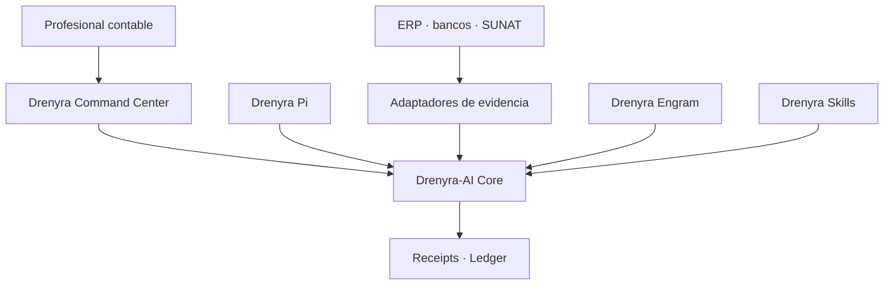

# Ecosystem Boundaries — Drenyra Pi (Pi-native Accounting Operations Harness)

> **Last updated:** 2026-08-11 (Design 1 — boundary & authority contract).
>
> Fiscal convention: monetary values in the Drenyra ecosystem are BigInt cents; no float is ever used for money; version/sequence numbers are JSON integers, never floats.

## Role in the ecosystem

Drenyra Pi is the **Pi-native Accounting Operations Harness**: a Pi extension that packages the operator experience for Drenyra AI. It is the direct accounting-domain counterpart of `gentle-pi`.

Drenyra Pi does **not** contain the accounting engine. It **installs and consumes a pinned, verified, package-local version of Drenyra AI** — never whatever binary happens to be on `PATH`.

## What Drenyra Pi is (in scope)

- Accounting operator persona: warm, direct, fiscal-first behavior.
- Startup panel: company and fiscal period context on session start.
- `/drenyra:*` commands: doctor, scope, status, capabilities, company, period, mission, receipt, evidence, verify, reconcile, close.
- Pi-native subagents: exploration, apply, verify, review.
- Model routing: per-phase model selection for fiscal work.
- Packaged skills and RDA (Receipt-Driven Accounting) command chains.
- Tool safety: broad-deny, narrow-allow permissions for fiscal actions.
- Company & period context: RUC-scoped context threaded across tools and agents.
- Drenyra Engram integration: institutional memory access (memory never authorizes).

## Explicit non-goals

Drenyra Pi is **not**:

- The accounting engine — that is `arkelythex/drenyra-command-center` (product) and `arkelythex/drenyra-ai` (runtime).
- An agent runtime — missions, candidates, receipts, gates, and ledger belong to `drenyra-ai`.
- A memory engine — observations and scope-first search belong to `drenyra-engram`.

## What Drenyra Pi must NOT contain long-term

- **Fiscal logic in command handlers.** Commands are thin: validate scope, delegate to Drenyra AI domain operations, render results.
- **A second copy of the runtime.** The engine is installed and pinned, never vendored or re-implemented.
- **Product surfaces** (UI, tenants, documents, SUNAT flows) — those live in Drenyra.

## Ecosystem authority contract (Design 1 — approved boundary)

### Responsibility contract

| Component | Responsibility | Must never |
| --- | --- | --- |
| **Drenyra** | Interface, inboxes, visualization, review and approval | Re-implement gates or mutate authoritative states directly |
| **Drenyra-AI** | Missions, candidates, materiality, authority, gates, receipts, ledger and recovery | Depend on the UI or trust agent narratives |
| **Drenyra Pi** | Harness optimized to run specialized agents | Resolve versions from PATH or bypass the Core |
| **Drenyra Engram** | Institutional memory and context retrieval | Authorize actions or treat memories as evidence |
| **Drenyra Skills** | Versioned accounting, fiscal and jurisdictional knowledge | Silently change frozen policies |
| **Adaptadores** | Gather evidence from ERP, banks, SUNAT and files | Claim success without a verifiable response |
| **Guardian Angel** | Independent and adversarial review | Approve its own work or substitute the professional |

### Chain of authority

1. The professional requests an outcome from Drenyra.
2. Drenyra creates a mission through the published Drenyra-AI contract.
3. Agents research, propose and prepare candidates.
4. Drenyra-AI computes identity, scope and materiality.
5. Gates determine which evidence and approval are required.
6. The professional approves when appropriate.
7. An adapter executes or confirms the external action.
8. Drenyra-AI records the result with a signed receipt and verifiable ledger.
9. Drenyra only represents the authoritative state returned by the Core.

### Dependency rule

- Drenyra and Drenyra Pi consume **published versions** of Drenyra-AI. Drenyra-AI never depends on them.
- The UI may go down and rebuild from Core state; a transcript may be lost and the mission recovered from events and evidence.
- **No consumer may convert a Core rejection into an approval.**

## Consumers and producers

| Direction | Party | Relation |
| --------- | ----- | -------- |
| Consumes | `drenyra-ai` | pinned, verified, package-local runtime (never `PATH`) |
| Consumes | `drenyra-engram` | memory reads/context (memory never authorizes) |
| Produces for | Pi users | the disciplined accounting operator experience |
| Provides | `drenyra-pi` package | installable via `pi install npm:drenyra-pi` |

## Current state and maturity

- Pre-alpha: contracts only (`package-contract`, `runtime-dependency`); no implementation yet.
- Slices will land as vertical PRs on released, pinned versions of `drenyra-ai` — never a checkout.

## Ownership and accountability

- Harness behavior, tool permissions, and pinning strategy: this repo.
- Runtime contracts and gates: `drenyra-ai`. Memory: `drenyra-engram`. Product: Drenyra.
- A pin verification failure is filed here with the full `doctor` output attached.

## Boundary enforcement

- Direction violations are caught in review: a PR that defines fiscal logic or duplicates runtime contracts in Drenyra Pi is rejected and redirected.
- Runtime pinning is part of the package contract (`contracts/runtime-dependency.md`); changing a pin is a release with a migration note.
